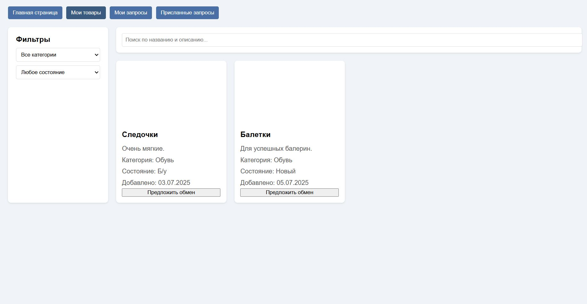
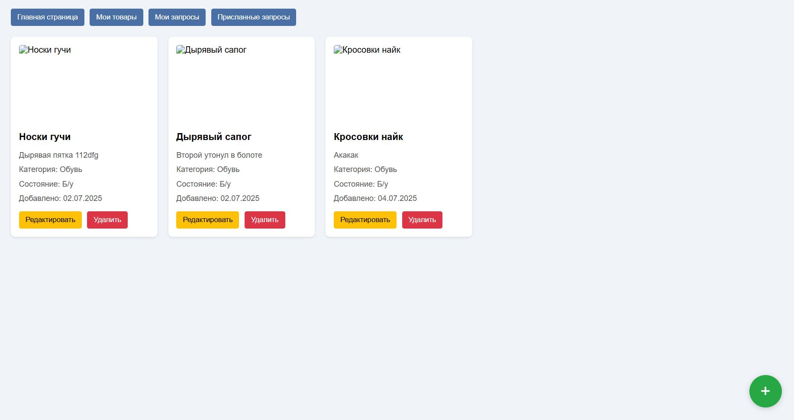
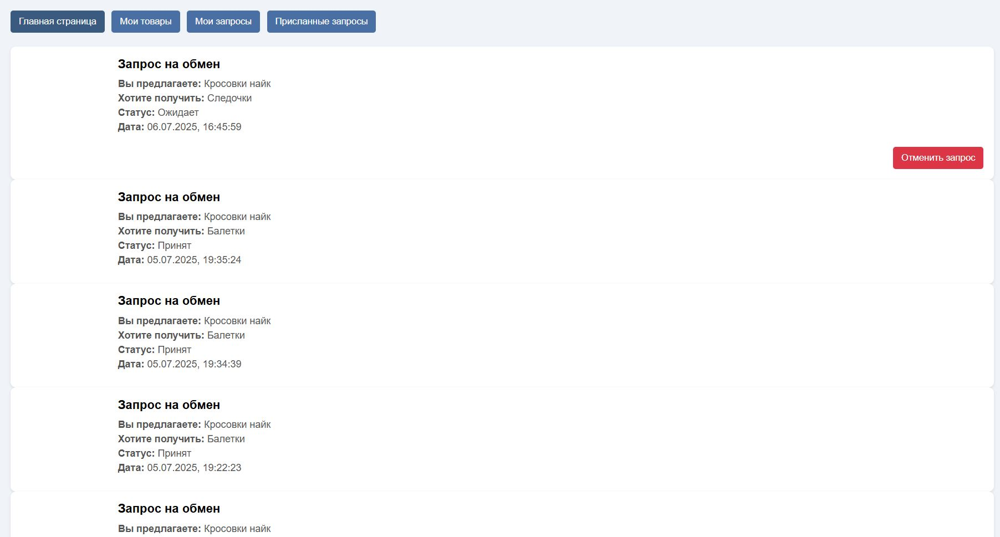
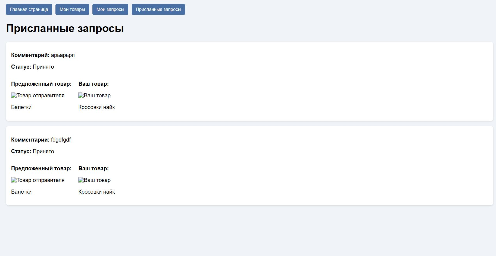

# Тестовое задание для Effective Mobile
## Установка и запуск
1. Клонировать проект
> git clone https://github.com/DeadGEEK990/EffectiveMobileTestTusk
2. Выполнить команду
> cd EffectiveMobileTestTusk
3. Создать или активировать виртуально окружение.
4. Установить poetry, если его нет.
> pip install poetry==1.8.4
5. Установить зависимости.
> poetry install
6. Создать миграцию.
> python manage.py makemigrations
7. Запустить миграцию.
> python manage.py migrate
8. Создать супер пользователя для доступа к админке.
> python manage.py createsuperuser
9. Запустить тесты
> pytest
10. Запустить приложение.
> python manage.py runserver

## Интерфейс приложения.
 
 
 
 
 
 

## URLS:
Главная страница - http://127.0.0.1:8000/ \
Мои товары - http://127.0.0.1:8000/my-items/ \
Мои запросы - http://127.0.0.1:8000/my-requests/ \
Присланные запросы - http://127.0.0.1:8000/received-requests/ \
Админка - http://127.0.0.1:8000/admin/ \
Документация API - http://127.0.0.1:8000/api/v1/docs/ \

## Примечания!
1. Название моделей немного другие. Требовалось название Ad, а в приложении ItemModel.
2. Категории товаров это не просто строковое поле. Это модель, экземпляр которой необходимо задавать через админку.
3. Документация API находится на соответствующем ендпоинте и в файле schema.yaml.